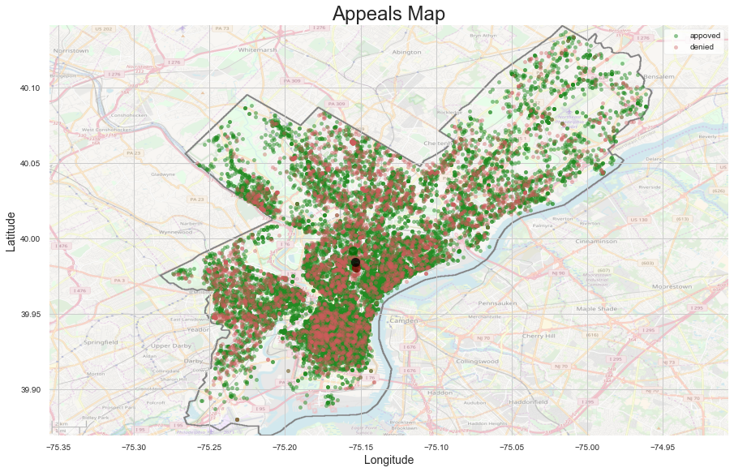

# Philadelphia Licenses and Inspections Appeals Decision Results
  

## Problem Identification  
Create the best possible model to accurately predict the appeal decision. This prediction model can help Philadelphia homeowners filing appeals with the L&I board. 

## Data Collection, Organization, and Definitions  
This research will be based on the statistical data provided by OpenDataPhilly portal in the [L&I Appeals dataset](https://www.opendataphilly.org/dataset/license-and-inspections-appeals/resource/b721ad52-9e27-46d2-b494-6bf0ef1c7603).  
The Department of Licenses and Inspections accepts applications for appeals of various violations, refusals, revocations, and denials to the following Boards: Board of Building Standards, Licenses and Inspections (L&I) Review Board, and Zoning Board of Adjustments. The Board Decisions dataset shows the decisions made by the Appeal Boards (LIRB, ZBA, BBS).  

##Exploratory Data Analysis  
Currently the Decision column for the dataset has 21 various outcomes: 'admin/review', 'affirmed', 'approved', 'boardaknowl', 'continued', 'denied', 'dismissed', 'granted', 'held', 'held/info', 'issued', 'late-apprvd', 'late-denied', 'moot', 'newhearnot', 'newhearyes', 'refused', 'remand', 'reschedule', 'revised', 'sustained'. To simplify the modeling process these values were translated in only three outcomes: 'approved', 'denied', and 'other'.  
Comparison between lat features and geocode_y as well as between lng and geocode_x showed very strong correlation. So only lat and lng were used in the data models.
Histogram of distances from Center City shows that the most of the records are concentrated closer to Center City and the number gradually drops further away. This is also consistent with the Center City being more densely built and more densely populated.
