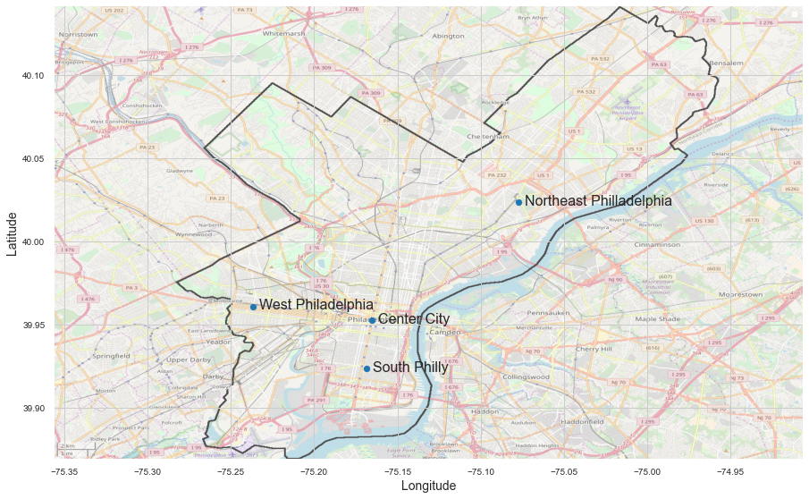
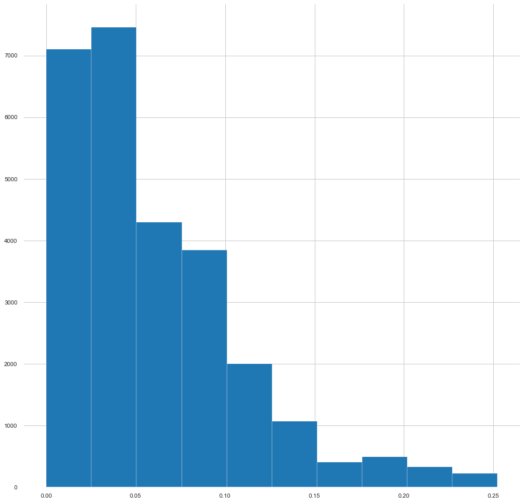

# Philadelphia Licenses and Inspections Appeals Decision Results
  

## Problem Identification  
Create the best possible model to accurately predict the appeal decision. This prediction model can help Philadelphia homeowners filing appeals with the L&I board. 

## Data Collection, Organization, and Definitions  
This research will be based on the statistical data provided by OpenDataPhilly portal in the [L&I Appeals dataset](https://www.opendataphilly.org/dataset/license-and-inspections-appeals/resource/b721ad52-9e27-46d2-b494-6bf0ef1c7603).  
The Department of Licenses and Inspections accepts applications for appeals of various violations, refusals, revocations, and denials to the following Boards: Board of Building Standards, Licenses and Inspections (L&I) Review Board, and Zoning Board of Adjustments. The Board Decisions dataset shows the decisions made by the Appeal Boards (LIRB, ZBA, BBS).  
  
## Exploratory Data Analysis  
### Reducing number of decision outcomes
Currently the Decision column for the dataset has 21 various outcomes: 'admin/review', 'affirmed', 'approved', 'boardaknowl', 'continued', 'denied', 'dismissed', 'granted', 'held', 'held/info', 'issued', 'late-apprvd', 'late-denied', 'moot', 'newhearnot', 'newhearyes', 'refused', 'remand', 'reschedule', 'revised', 'sustained'. To simplify the modeling process these values were translated in only three outcomes: 'approved', 'denied', and 'other'.  
### Adding 'lawyer' feature  
It appears that the top appellants are all lawyers. This can’t be verified without access to the Philadelphia Bar Association records. 
An assumption has been made that ESQ or ESQUIRE in the field identifies the primary appellant as a lawyer.  
| appellant | No of Recs |
| ----- | ------------------------------------ |
|SHAWN D. WARD, ESQUIRE | 421|
|ZHEN JIN | 288|
|JOSEPH BELLER, ESQ. | 254|
|DAVID ORPHANIDES, ESQ. | 238|
|SHAWN WARD, ESQ. | 228|
|RONALD PATTERSON, ESQ. | 225|
|ALAN NOCHUMSON, ESQ. | 198|
|RUSTIN OHLER | 182|
|BEDITZA CADILLO | 170|
|BRETT D. FELDMAN, ESQUIRE | 165|
|VERN ANASTASIO, ESQ | 162|
|STEPHEN G. POLLOCK, ESQUIRE | 158|
|CARL PRIMAVERA, ESQUIRE | 150|
|LEO MULVIHILL, JR., ESQ. | 147|
|HENRY M. CLINTON, ESQ | 143|

### Addign landmarks for more feature generation
Following four landmarks were created to assist in creating additional features.
  

### Appeals Map
The more densely populated areas of the city have higher density of appeals. City parks, airports and other non-populated areas do appear empty on the map as well.
Approved and Denied centroids are very close to each other.
  

### Distances from Center City
Histogram of distances from Center City shows that the most of the records are concentrated closer to Center City and the number gradually drops further away. This is also consistent with the Center City being more densely built and more densely populated.
  

