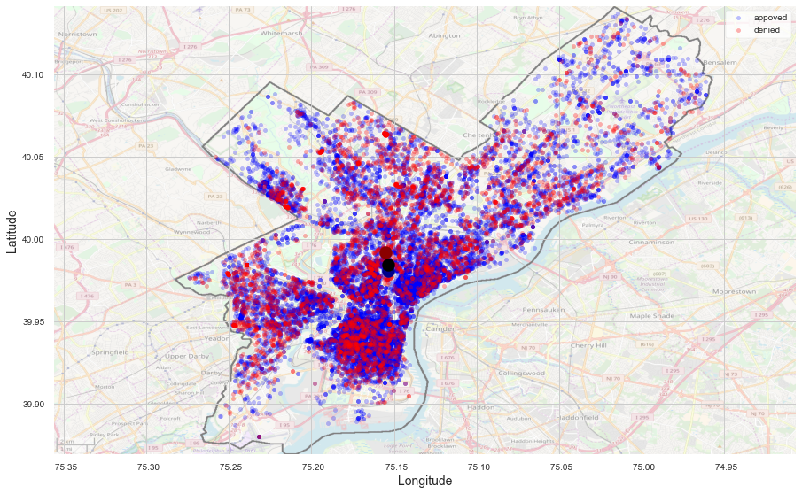

# Philadelphia Licenses and Inspections Appeals Decision Results

# Problem Identification
Predict the Decision of the Philadelphia Department of Licences and Inspections (L&I) on appeals.

This research will be based on the statistical data provided by OpenDataPhilly portal in the [L&I Appeals dataset](https://www.opendataphilly.org/dataset/license-and-inspections-appeals/resource/b721ad52-9e27-46d2-b494-6bf0ef1c7603).

My goal is to create the best possible model to accurately predict the appeal decision. This prediction model can help Philadelphia homeowners filing appeals with the L&I board. The model will show which variables can positively or negatively affect the L&I appeal decision.
